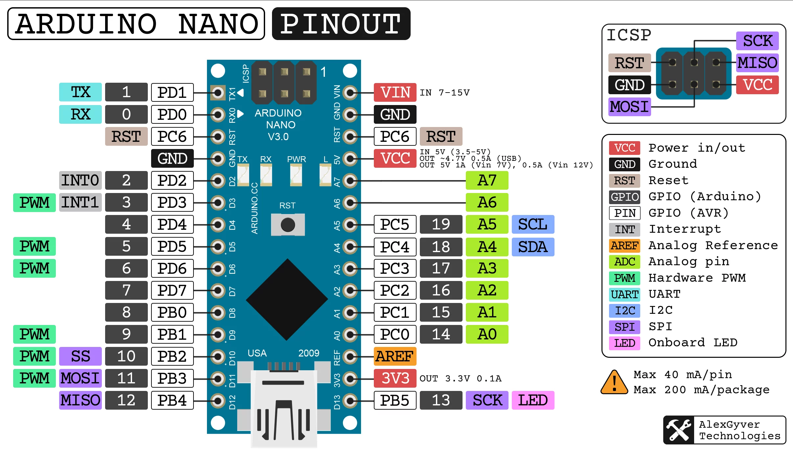
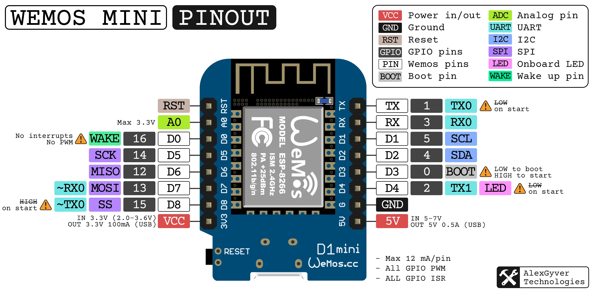
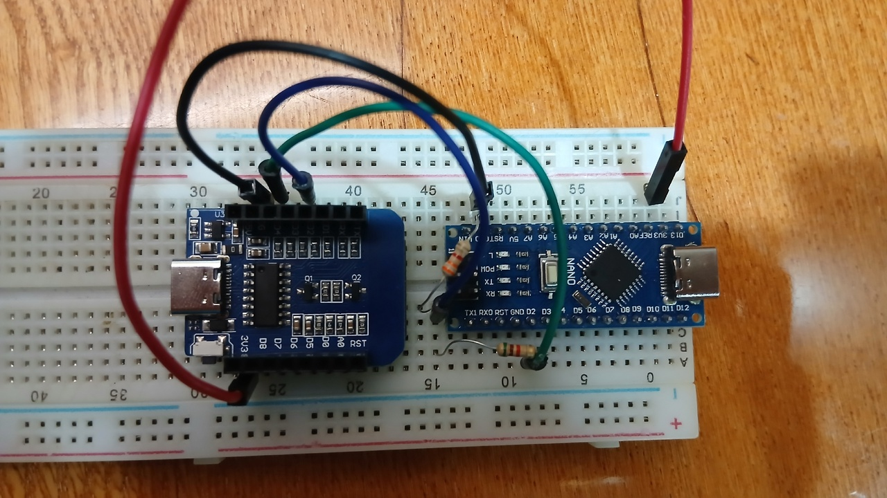

# Документация устройства FlowerMonitoring 

## Энергонезависимая память микроконтроллера

Переменные, хранящиеся в EEPROM памяти Arduino Nano и необходимые для конфигурации устройства или подключению к сети ESP.

Пароль точки доступа ESP `passwordAP` (#11) является константой во избежании ситуации, когда пользователь забывает этот пароль, и теряет возможность для подключения к точки доступа устройства для изменения пароля. Он находится на "коробке". Также, микроконтроллер хранит уникальный токен устройства `token` (#12).

| # | Название | Системное имя | Тип | Длина / значения |
|---|----------|---------------|-----|-------|
| 1 | IP / домен удалённого сервера | domen | String | 40 |
| 2 | Имя сети | ssidCLI | String | 20 |
| 3 | Пароль сети #2 | passwordCLI | String | 20 |
| 4 | Имя точки доступа ESP | ssidAP | String | 20 |
| 5 | Пароль устройства | password | String | 20 |
| 6 | Интервал отправки данных датчиков серверу (в минутах) | sendingDelay | Int | [1; 60] |

## Протокол общения Arduino Nano и ESP8266

По программному UART передаются сообщения вида `KEY:VALUE`.

| Сообщение | KEY | VALUE | Отправитель | Ответчик |
|-----------|-----|-------|-------------|----------|
| Переключение ESP в CLI мод | 1 | 1:`{domen}`;2:`{ssidCLI}`;3:`{passwordCLI}`;5:`{password}`;12:`{token}`; | Arduino | ESP |
| Переключение ESP в AP мод | 2 | 1:`{domen}`;2:`{ssidCLI}`;3:`{passwordCLI}`;4:`{ssidAP}`;5:`{password}`;6:`{sendingDelay}`;11:`{passwordAP}`;12:`{token}`; | Arduino | ESP |
| Обновление полей в EEPROM | 3 | 1:`{domen}`;2:`{ssidCLI}`;3:`{passwordCLI}`;4:`{ssidAP}`;5:`{password}`;6:`{sendingDelay}`; | ESP | Arduino |
| Вывод в монитор порта | 4 | Текст сообщения | ESP | Arduino |
| Статус получения | 5 | bool | Любой | Любой |
| Передача данных датчиков | 6 | 101:`{value1}`;102:`{value1}`;103:`{value1}`; | Arduino | ESP |

## Отображение сообщений на жидкокристаллическом дисплее

На дисплее отображаются текущий статус устройства и важные сообщения, на первой и второй строках соответственно. Сообщения могут быть длиннее, чем 16-колоночный дисплей, поэтому реализован механизм "бегущей строки".

## Схемы

